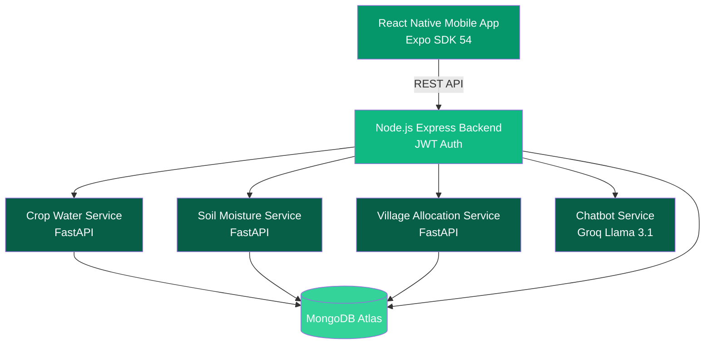

# Architecture Diagram Guidelines

## 📐 Diagram Specifications

### Size Requirements (Desktop-Optimized)
- **Recommended Width:** 1200-1600px
- **Recommended Height:** 800-1200px (maintain readability)
- **Format:** PNG or SVG (vector preferred)
- **Resolution:** 2x for retina displays (if PNG)

---

## 🎨 Style Guidelines

### Color Palette (Match JalSakhi Theme)
- **Primary:** #059669 (emerald-600) - Main components
- **Secondary:** #10b981 (emerald-500) - Connections
- **Accent:** #34d399 (emerald-400) - Highlights
- **Dark:** #064e3b (emerald-900) - Text/borders
- **Light:** #ecfdf5 (emerald-50) - Backgrounds

### Recommended Tools
1. **Lucidchart** - Professional diagrams
2. **draw.io** - Free, powerful
3. **Mermaid.js** - Code-based diagrams
4. **PlantUML** - Text-to-diagram
5. **Figma** - Design-focused

---

## 📋 Three Required Diagrams

### 1. Microservices Architecture Diagram
**Location:** Stats section, first placeholder  
**File name:** `microservices-architecture.png`

**Should Include:**
- All 4 FastAPI ML services (separate boxes)
- Node.js Express backend (central)
- MongoDB Atlas database
- React Native mobile app
- API Gateway / Load Balancer
- JWT Authentication flow
- Service-to-service communication arrows
- External APIs (Weather, IoT sensors)

**Key Components to Show:**
```
┌─────────────────┐
│  Mobile App     │
│  React Native   │
│  Expo SDK 54    │
└────────┬────────┘
         │ REST API
         ↓
┌─────────────────┐
│   API Gateway   │
│   (Optional)    │
└────────┬────────┘
         │
    ┌────┴─────┬─────────┬─────────┐
    ↓          ↓         ↓         ↓
┌────────┐ ┌────────┐ ┌────────┐ ┌────────┐
│Crop    │ │Soil    │ │Village │ │Chatbot │
│Water   │ │Moisture│ │Water   │ │Service │
│Service │ │Service │ │Alloc   │ │Llama3.1│
│FastAPI │ │FastAPI │ │FastAPI │ │FastAPI │
└────────┘ └────────┘ └────────┘ └────────┘
    │          │         │         │
    └──────────┴─────────┴─────────┘
               │
         ┌─────┴─────┐
         │  Node.js  │
         │  Backend  │
         │  Express  │
         └─────┬─────┘
               │
         ┌─────┴─────┐
         │  MongoDB  │
         │   Atlas   │
         └───────────┘
```

**Labels to Include:**
- Port numbers (if applicable)
- Technology stack per service
- Data flow arrows
- Authentication boundaries

---

### 2. User Flow & Data Pipeline
**Location:** Stats section, second placeholder  
**File name:** `user-flow-data-pipeline.png`

**Should Include:**
- User journey from app launch to result
- Data flow through system layers
- Database read/write operations
- Cache layers
- ML model inference steps
- Response path back to user

**Flow Stages:**
1. **User Input** - Farmer enters data in mobile app
2. **API Request** - Data sent to backend
3. **Authentication** - JWT verification
4. **Data Validation** - Input sanitization
5. **ML Service Call** - Forward to appropriate microservice
6. **Model Inference** - ML prediction
7. **Result Processing** - Format and enhance data
8. **Database Storage** - Save for history
9. **Response** - Return to mobile app
10. **UI Update** - Display results to user

**Example Flow:**
```
User Input → Validation → Auth Check → Route to Service
     ↓
ML Inference → Process Result → Cache → Database
     ↓
Format Response → Return to App → Display to User
```

**Highlight:**
- Decision points (if/else)
- Error handling paths
- Caching strategy
- Database queries

---

### 3. ML Pipeline Architecture
**Location:** Stats section, third placeholder  
**File name:** `ml-pipeline-architecture.png`

**Should Include:**
- Data collection sources
- Data preprocessing steps
- Model training workflow
- Model evaluation metrics
- Model deployment process
- Inference serving
- Model monitoring

**Pipeline Stages:**

**Training Pipeline:**
```
Raw Data → Preprocessing → Feature Engineering
    ↓
Train/Test Split → Model Training → Hyperparameter Tuning
    ↓
Model Evaluation → Model Selection → Model Registry
    ↓
Deploy to FastAPI Service
```

**Inference Pipeline:**
```
User Request → Load Preprocessor → Transform Input
    ↓
Load Model → Run Inference → Post-process Output
    ↓
Return Prediction
```

**ML Models to Show:**
1. **Crop Water Model** - Random Forest Classifier
2. **Soil Moisture** - LSTM Time Series
3. **Village Allocation** - Facebook Prophet
4. **Chatbot** - Groq Llama 3.1 (API)

**Technical Details:**
- Libraries: scikit-learn, TensorFlow, pandas, NumPy
- Model storage: joblib files
- Preprocessing: encoder files
- Metrics tracking: JSON files

---

## 🔧 Integration Instructions

### Step 1: Create Diagrams
Using your preferred tool, create the three diagrams following the specifications above.

### Step 2: Export Images
- **Format:** PNG (2x resolution) or SVG
- **Naming:** Use descriptive names
  - `microservices-architecture.png`
  - `user-flow-data-pipeline.png`
  - `ml-pipeline-architecture.png`

### Step 3: Add to Project
```bash
cp your-diagrams/*.png landing-page/public/images/
```

### Step 4: Update Stats.tsx
Replace the placeholder divs in `src/components/Stats.tsx`:

```tsx
{/* Diagram 1 */}
<div className="bg-white dark:bg-slate-800 rounded-2xl overflow-hidden border border-slate-200 dark:border-slate-700">
  
  <div className="p-4 bg-slate-50 dark:bg-slate-700/50">
    <h4 className="text-lg font-bold text-slate-800 dark:text-white mb-1">
      Microservices Architecture
    </h4>
    <p className="text-sm text-slate-600 dark:text-slate-400">
      Distributed system with 4 independent ML services, Node.js backend, and MongoDB Atlas
    </p>
  </div>
</div>

{/* Diagram 2 */}
<div className="bg-white dark:bg-slate-800 rounded-2xl overflow-hidden border border-slate-200 dark:border-slate-700">
  
  <div className="p-4 bg-slate-50 dark:bg-slate-700/50">
    <h4 className="text-lg font-bold text-slate-800 dark:text-white mb-1">
      User Flow & Data Pipeline
    </h4>
    <p className="text-sm text-slate-600 dark:text-slate-400">
      Complete data journey from user input to ML inference and response
    </p>
  </div>
</div>

{/* Diagram 3 */}
<div className="bg-white dark:bg-slate-800 rounded-2xl overflow-hidden border border-slate-200 dark:border-slate-700">
  
  <div className="p-4 bg-slate-50 dark:bg-slate-700/50">
    <h4 className="text-lg font-bold text-slate-800 dark:text-white mb-1">
      ML Pipeline Architecture
    </h4>
    <p className="text-sm text-slate-600 dark:text-slate-400">
      Machine learning workflow from data collection to model deployment
    </p>
  </div>
</div>
```

---

## 💡 Quick Start with Mermaid.js

If you want code-based diagrams, use Mermaid:

### Example: Microservices Architecture


### Render Mermaid:
1. Visit https://mermaid.live/
2. Paste code above
3. Export as PNG/SVG
4. Use in landing page

---

## 📊 Alternative: Interactive Diagrams

For interactive diagrams, consider:

### React Flow
```bash
npm install reactflow
```

Create interactive node-based diagrams users can pan/zoom.

### Mermaid in React
```bash
npm install mermaid
```

Render diagrams from code at runtime.

---

## ✅ Checklist

Before finalizing:
- [ ] All 3 diagrams created
- [ ] Images optimized (compressed)
- [ ] Alt text descriptive
- [ ] Dark mode compatible (or separate dark versions)
- [ ] Mobile responsive (readable on small screens)
- [ ] File sizes reasonable (<500KB each)
- [ ] Images placed in `/public/images/`
- [ ] Stats.tsx updated with actual images
- [ ] Build tested (`npm run build`)
- [ ] Visual quality verified

---

## 🎯 Expected Result

After adding all three diagrams, the landing page will:
- ✅ Showcase complete system architecture visually
- ✅ Help technical recruiters understand the implementation
- ✅ Demonstrate microservices expertise
- ✅ Show ML pipeline sophistication
- ✅ Prove full-stack development skills

---

**Ready to add your diagrams!** 🎨
